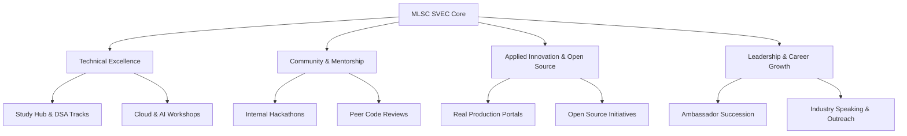

# About MLSC SVEC

**Microsoft Learn Student Club, Sri Vasavi Engineering College (MLSC SVEC)** is an official student-led technical community recognized and supported by the global Microsoft Learn Student Ambassadors program and the Department of Computer Science & Engineering at Sri Vasavi Engineering College, Tadepalligudem, Andhra Pradesh.

MLSC SVEC serves as a premier innovation incubator and hands-on learning community, empowering undergraduates across all engineering disciplines to transform intellectual curiosity into production-grade capability.

---

## Organizational Identity

- **Parent Affiliation:** Microsoft Learn Student Ambassador (MLSA) Community Program
- **Host Institution:** Sri Vasavi Engineering College (Autonomous), Pedatadepalli, Tadepalligudem
- **Official Web Portal:** [https://mlscsvec.com](https://mlscsvec.com)
- **Documentation Hub:** [https://docs.mlscsvec.com](https://docs.mlscsvec.com)
- **Primary Technical Focus:** Generative AI & Large Language Models, Cloud Computing & DevOps, Full-Stack Web/App Engineering, Data Science, and Open-Source Collaboration.

---

## Founding Philosophy: "Where Curiosity Becomes Capability"

Traditional academic curricula often introduce theoretical computing paradigms without providing immediate, high-velocity avenues for practical software implementation, architecture design, and deployment. 

MLSC SVEC bridges this gap through:
1. **Peer-to-Peer Learning:** High-performing students actively mentor and teach junior cohorts through code reviews, interactive workshops, and study sprints.
2. **Production-First Engineering:** Club members do not merely build demo apps; they design, deploy, and maintain scaled web applications, microservices, and databases used by thousands of campus students.
3. **Open Community Culture:** Fostering an ego-free, highly collaborative environment where any student from any engineering branch (CSE, AIML, IT, ECE, EEE, ME, CE) can contribute and grow.

---

## Core Pillars of the Organization

1. **Technical Excellence:** Continuous skill development in cutting-edge ecosystems (Azure, Next.js, Node.js, Python, TypeScript, Docker, Kubernetes).
2. **Community Mentorship:** Making knowledge accessible through structured roadmaps (Striver's SDE Track, System Design, DSA, Generative AI).
3. **Applied Innovation:** Building real systems such as the MLSC Web Platform, Custom WebRTC Meeting Server (500 peers), and automated ticketing engines.
4. **Leadership & Career Readiness:** Preparing student engineers for top-tier internships, open-source programs (GSOC, Hacktoberfest), and high-impact engineering careers.

---

## Official Links & Repositories

| Resource | URL |
| :--- | :--- |
| **Main Web Portal** | [https://mlscsvec.com](https://mlscsvec.com) |
| **Official Documentation** | [https://docs.mlscsvec.com](https://docs.mlscsvec.com) |
| **Study Hub** | [https://mlscsvec.com/study](https://mlscsvec.com/study) |
| **Events & Hackathons** | [https://mlscsvec.com/events](https://mlscsvec.com/events) |
| **Issue Tracker** | [https://mlscsvec.com/issue-tracker](https://mlscsvec.com/issue-tracker) |
| **GitHub Organization** | [https://github.com/MLSC-SVEC](https://github.com/MLSC-SVEC) |
