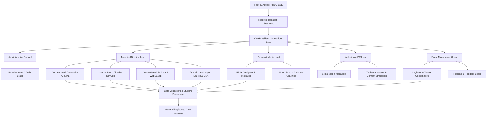

# Organizational Structure

MLSC SVEC operates under a tiered, decentralized structure that balances strategic administrative oversight with rapid domain execution.

---

## 1. Governance Hierarchy Diagram

---

## 2. Tier Breakdown & Responsibilities

### Tier 1: Faculty Advisory & Executive Leadership
- **Faculty Advisor:** Provides institutional liaison with college administration, approves academic venue allocations, and validates official certifications.
- **Lead Ambassador (President):** Serves as the official Microsoft Learn Student Ambassador lead, steers organizational vision, coordinates with Microsoft global program managers, and chairs the executive council.
- **Vice President / Head of Operations:** Manages day-to-day cross-team synchronization, oversees resource allocation, tracks OKR progress, and resolves escalations.

### Tier 2: Domain Leads (Division Heads)
- **Technical Lead:** Architects club platforms, leads the engineering team, maintains Git repositories, enforces code standards, and reviews pull requests.
- **Design & Media Lead:** Manages visual branding, UI/UX design systems, poster generation, promotional video assets, and stage backdrops.
- **Marketing & Outreach Lead:** Drives social media campaigns (LinkedIn, Instagram, X), writes technical blogs, oversees community announcements, and manages sponsorship outreach.
- **Event Management Lead:** Formulates event proposals, oversees physical venue logistics, manages audio/visual requirements, and supervises on-site registration desks.

### Tier 3: Core Volunteers & Developers
- Active contributors who build software features, write test suites, moderate communication servers, conduct live peer study sessions, and staff live event operations.

### Tier 4: General Members
- Enrolled students who utilize the Study Hub, participate in hackathons, complete learning sheets, earn certificates, and attend technical bootcamps.
