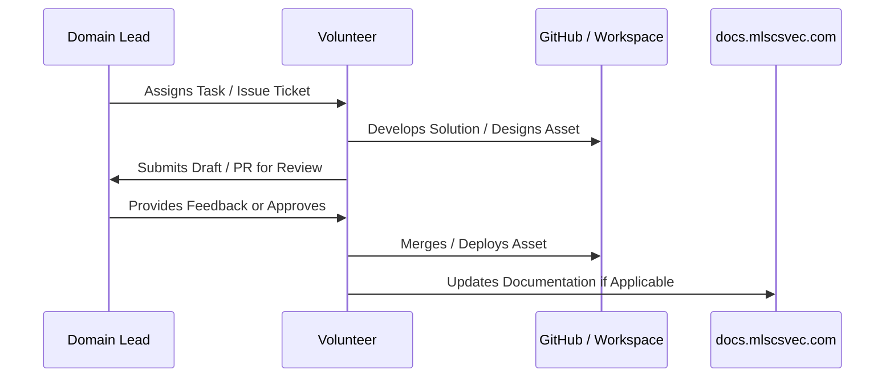

# New Volunteer Guide

Congratulations on being selected as an **MLSC SVEC Core Volunteer**! Volunteers form the operational backbone of our club, powering software releases, event logistics, and community engagement.

---

## 1. Core Responsibilities

As a volunteer, you are entrusted to:
- **Be Active & Reliable:** Deliver assigned domain tasks on time. If facing an academic blocker or emergency, notify your Domain Lead at least 24 hours in advance.
- **Maintain High Standards:** Ensure code quality, visual aesthetics, and respectful communication in all student interactions.
- **Support Live Events:** Assist with crowd management, hardware/software lab setup, participant check-ins, and Q&A sessions.
- **Participate in Open Source:** Contribute to the MLSC SVEC codebase via GitHub issues and pull requests.

---

## 2. Volunteer Workflow Cycle

---

## 3. Communication Etiquette

- Use dedicated team channels rather than private DMs for club-related coordination so knowledge is preserved.
- When creating pull requests or submitting assets, link the relevant issue ticket and include screenshots.
- Never share internal passwords or unpublished event details outside core volunteer channels.
