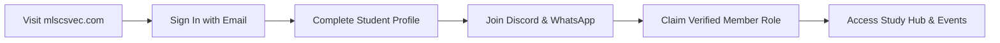

# Membership Eligibility & Joining

---

## 1. Eligibility Criteria

Membership to MLSC SVEC is open to all students currently enrolled at **Sri Vasavi Engineering College (Autonomous)**, regardless of:
- **Academic Branch:** Open to Computer Science & Engineering, Artificial Intelligence & Machine Learning, Cyber Security, Data Science, Information Technology, Electronics & Communication Engineering, Electrical & Electronics Engineering, Mechanical Engineering, Civil Engineering, and MCA/MBA programs.
- **Academic Year:** Open to 1st, 2nd, 3rd, and 4th Year undergraduate and postgraduate students.
- **Skill Level:** Open from absolute beginners to experienced software engineers and researchers.

---

## 2. Membership Registration Workflow

1. **Authentication:** Visit [https://mlscsvec.com](https://mlscsvec.com) and sign in using your authenticated Google account.
2. **Profile Completion:** Provide your college roll number, department, graduation year, and GitHub/LinkedIn handles.
3. **Verification:** Join the official Discord server and trigger automated role claim in `#verification`.
4. **Active Status:** Once verified, you gain instant access to all club roadmaps, hackathon discounts, and peer learning cohorts.
