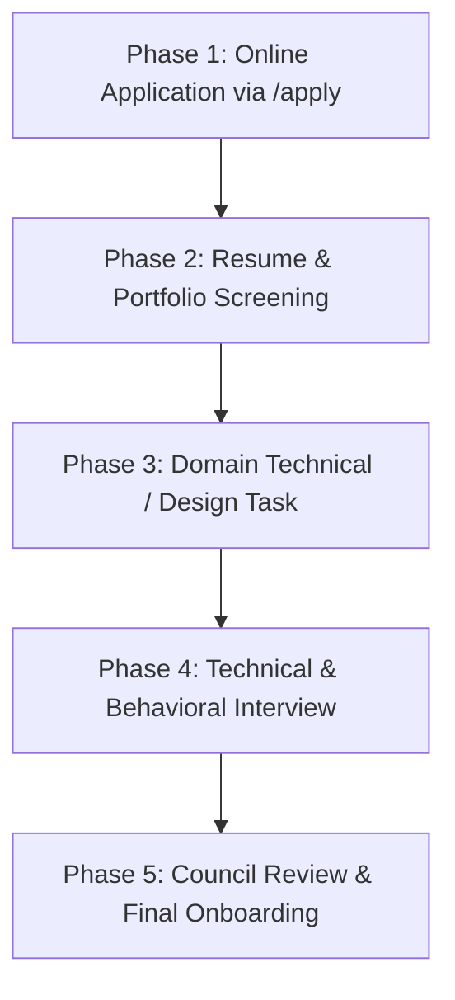

# Recruitment & Selection Process

MLSC SVEC conducts structured, merit-based recruitments twice a year (at the onset of Odd and Even semesters) to select dedicated student leaders for Core Volunteer and Domain Lead roles.

---

## 1. Multi-Stage Selection Pipeline

### Phase 1: Online Application (`/apply`)
Applicants submit their background, project links, domain preference (AI/ML, Cloud/DevOps, Web/App, Design, Marketing, Event Management), and statement of purpose.

### Phase 2: Resume & Portfolio Screening
The Core Council evaluates previous projects, GitHub repositories, Figma design files, or writing samples for originality, technical curiosity, and consistency.

### Phase 3: Practical Domain Task
Candidates are given a realistic 48-hour challenge tailored to their applied domain:
- **Web/App:** Implement a responsive UI component or small Next.js API route.
- **AI/ML:** Build a quick LLM prompt pipeline, fine-tuning script, or exploratory data analysis notebook.
- **Design:** Create an event banner or UI mockup conforming to the MLSC SVEC brand palette.
- **Marketing/Events:** Draft an event promotion campaign strategy and budget proposal.

### Phase 4: Technical & Culture Fit Interview
A 20-minute panel interview with the Lead Ambassador and Domain Leads assessing:
- Technical reasoning and problem-solving methodology.
- Alignment with club culture (peer learning, reliability, zero ego).
- Availability and commitment to the academic semester.

### Phase 5: Council Review & Onboarding
Selected candidates receive official welcome emails, onboarding tokens, and access to internal workspaces.
