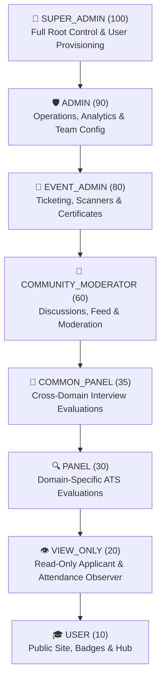
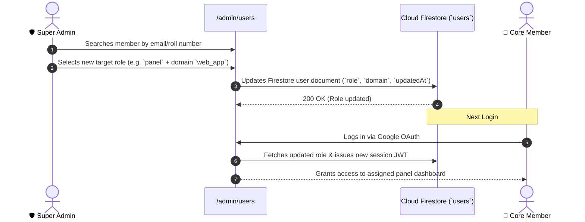

# Role-Based Access Control (RBAC) & Permissions

MLSC SVEC enforces a strict **Role-Based Access Control (RBAC)** architecture across all web applications, administrative panels, server actions, and Cloud Firestore security rules.

---

## 1. Role Hierarchy & Weight Matrix

Each role is assigned a numeric hierarchical weight (`ROLE_HIERARCHY`) that governs authorization thresholds and prevents lower-privilege users from modifying higher-privilege accounts:



| Role Identifier (`Role`) | Human Label | Hierarchy Weight | Primary Scope |
| :--- | :--- | :---: | :--- |
| **`super_admin`** | Super Administrator | **`100`** | System root, user role provisioning, API keys, hiring toggles, financials. |
| **`admin`** | General Administrator | **`90`** | Operational activity logs, application analytics, team profiles. |
| **`event_admin`** | Event Operations Admin | **`80`** | Event lifecycle, attendee verification, QR attendance, certificates. |
| **`community_moderator`** | Community Moderator | **`60`** | Moderation queue, community post reviews, comment moderation. |
| **`common_panel`** | Cross-Domain Interview Panel | **`35`** | Reviewing and interviewing candidates across all domains. |
| **`panel`** | Domain-Specific Support Panel | **`30`** | Reviewing assigned candidates in designated track (e.g., AI, Web, Cloud). |
| **`view_only`** | View-Only Admin (Applications) | **`20`** | Read-only observation of candidate applications, rosters, and dossiers across domains without mutation privileges. |
| **`user`** | Authenticated Member / Participant | **`10`** | Public portal, event registration, study hub, daily quizzes, profile badge. |

---

## 2. Granular Permissions Matrix

| Feature / Subsystem | `super_admin` | `admin` | `event_admin` | `community_moderator` | `common_panel` | `panel` | `view_only` | `user` |
| :--- | :---: | :---: | :---: | :---: | :---: | :---: | :---: | :---: |
| **User Role Management (`/admin/users`)** | ✅ | ❌ | ❌ | ❌ | ❌ | ❌ | ❌ | ❌ |
| **Hiring Settings & Provisioning (`/admin/hiring-settings`)** | ✅ | ❌ | ❌ | ❌ | ❌ | ❌ | ❌ | ❌ |
| **Financial Ledger & Payments (`/admin/payments`)** | ✅ | ✅ | ❌ | ❌ | ❌ | ❌ | ❌ | ❌ |
| **System Operations & Bug Tracker (`/admin/operations`)** | ✅ | ✅ | ❌ | ❌ | ❌ | ❌ | ❌ | ❌ |
| **Event Creation & Management (`/admin/events`)** | ✅ | ✅ | ✅ | ❌ | ❌ | ❌ | ❌ | ❌ |
| **QR Attendance & Scanner (`/admin/attendance`)** | ✅ | ✅ | ✅ | ❌ | ❌ | ❌ | ❌ (View Only) | ❌ |
| **Community Post Moderation (`/admin/community`)** | ✅ | ✅ | ❌ | ✅ | ❌ | ❌ | ❌ | ❌ |
| **Candidate Review (All Domains)** | ✅ | ✅ | ❌ | ❌ | ✅ | ❌ | ✅ (View Only) | ❌ |
| **Candidate Review (Assigned Domain Only)** | ✅ | ✅ | ❌ | ❌ | ✅ | ✅ | ✅ (All) | ❌ |
| **Export Applications (PDF / Excel)** | ✅ | ✅ | ❌ | ❌ | ✅ | ✅ | ✅ | ❌ |
| **Interview Rubric Scoring / Mutations** | ✅ | ✅ | ❌ | ❌ | ✅ | ✅ | ❌ | ❌ |
| **Application Status / Attendance Mutations** | ✅ | ✅ | ❌ | ❌ | ✅ | ✅ | ❌ | ❌ |
| **Submit Community Post / Comment** | ✅ | ✅ | ✅ | ✅ | ✅ | ✅ | ✅ | ✅ |
| **Event Registration & Digital ID Badge** | ✅ | ✅ | ✅ | ✅ | ✅ | ✅ | ✅ | ✅ |

---

## 3. Session Authentication & Token Security

Authentication uses secure, stateless, signed **JSON Web Tokens (JWT)** generated with the `HS256` cryptographic algorithm:

### JWT Claims Payload
```json
{
  "role": "panel",
  "username": "Priya Sharma",
  "email": "priya.ai@sves.org.in",
  "domain": "gen_ai",
  "iat": 1756704000,
  "exp": 1756790400
}
```

### Route Middleware Protection (`/src/proxy.ts`)
1. **Edge Inspection:** Every incoming request to `/admin/:path*` is intercepted by the Next.js Proxy/Middleware.
2. **Signature Verification:** The `session` HttpOnly cookie is validated against `process.env.JWT_SECRET`.
3. **Header Injection:** Validated claims are injected into upstream request headers:
   - `X-User-Role`: `super_admin` | `admin` | `panel` ...
   - `X-User-Username`: Display name
   - `X-User-Email`: Reviewer email
   - `X-Panel-Domain`: Domain filter (for scoped panel members)
4. **Invalid Token Handling:** Unauthenticated or expired requests are automatically redirected to `/login` with the session cookie expunged.

---

## 4. Role Elevation & Provisioning SOP



### Security Directives:
1. **No Self-Elevation:** Users cannot alter their own role or promote peers to roles equal to or higher than their own hierarchy weight.
2. **Domain Isolation:** Panel members with `panel` role can only access candidates in their assigned `domain`. Attempting to access cross-domain candidate IDs returns `403 Forbidden`.
3. **Session Revocation:** Changing a user's role in Firestore requires them to re-authenticate or wait for token expiry (24 hours) for full claim refresh.
