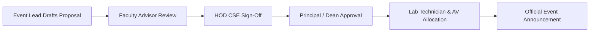

# Event Approval & Venue Coordination

All physical events held on the Sri Vasavi Engineering College campus must receive formal academic approval prior to public announcement.

---

## 1. Approval Workflow Stages

1. **Faculty Advisor Review:** Evaluates alignment with club charter, schedule feasibility, and resource requirements.
2. **HOD CSE Sign-Off:** Formally sanctions the event under department co-curricular activities.
3. **Dean/Principal Sanction:** Grants permission for external guests, weekend lab access, and inter-departmental participation.
4. **Lab & AV Booking:** Booking confirmation entered with the college IT systems administrator for projector systems, lab AC, and LAN access.

---

## 2. Mandatory Venue Checklist

- [ ] High-definition projector and projection screen functioning.
- [ ] Wireless lapel microphones and podium mic tested.
- [ ] Backup power (UPS / Generator backup) confirmed for computing labs.
- [ ] College firewall whitelisting requested for required endpoints (e.g., GitHub, Azure Portal, NPM registry).
