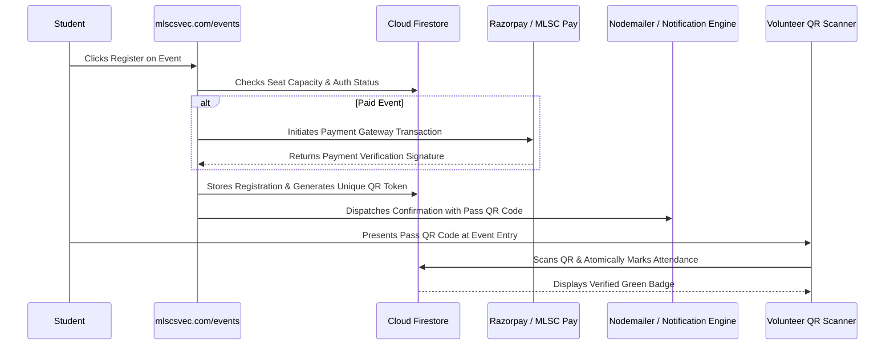

# Event Execution & Digital Registrations

MLSC SVEC utilizes a custom-built digital registration and QR ticketing engine integrated directly into `mlscsvec.com`.

---

## 1. Digital Registration Architecture

---

## 2. On-Site Check-In Operating Protocol

1. **Scanner Readiness:** Volunteers open the admin scanner tool at `mlscsvec.com/admin/attendance` on mobile devices.
2. **Scan Verification:** The scanner reads the attendee's QR token, queries Firestore in real-time, and confirms:
   - Attendee Name & College Roll Number
   - Valid Payment / Registration Status
   - Has Not Already Been Scanned (Prevents duplicate entry)
3. **Badge Handover:** Attendee is marked `present` and provided their event kit.
