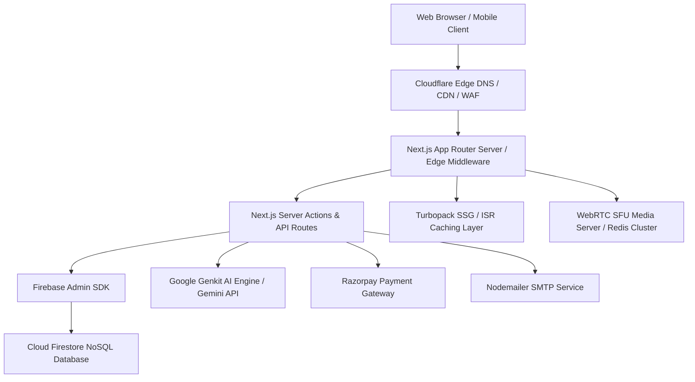

# Architecture & Technology Stack

MLSC SVEC's core web platform (`mlscsvec.com`) and auxiliary systems are built using a modern, scalable, full-stack cloud architecture.

---

## 1. High-Level System Architecture



---

## 2. Core Technology Stack Table

```text
┌─────────────────────────┬──────────────────────────────────────────────┐
│ Layer                   │ Technologies & Frameworks                    │
├─────────────────────────┼──────────────────────────────────────────────┤
│ Frontend Framework      │ Next.js 16 (App Router), React 19            │
├─────────────────────────┼──────────────────────────────────────────────┤
│ Language & Styling      │ TypeScript 5.x, Tailwind CSS, Radix UI Prims │
├─────────────────────────┼──────────────────────────────────────────────┤
│ Animations & Motion     │ Framer Motion, Motion One, CSS Keyframes     │
├─────────────────────────┼──────────────────────────────────────────────┤
│ Database & Backend Auth │ Google Cloud Firestore, Firebase Admin SDK   │
├─────────────────────────┼──────────────────────────────────────────────┤
│ AI & LLM Pipelines      │ Google Genkit 1.11, Google AI Gemini 1.5/2.0 │
├─────────────────────────┼──────────────────────────────────────────────┤
│ Payment Processing      │ Razorpay Gateway, Custom MLSC Ledger         │
├─────────────────────────┼──────────────────────────────────────────────┤
│ Real-Time Communication │ Node.js, Socket.io, Mediasoup WebRTC, Redis  │
├─────────────────────────┼──────────────────────────────────────────────┤
│ Edge & DNS Routing      │ Cloudflare DNS, SSL/TLS, Caching Rules       │
└─────────────────────────┴──────────────────────────────────────────────┘
```
