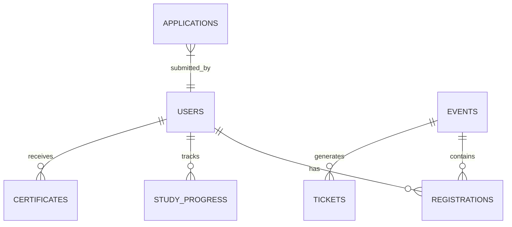

# Database & Firestore Schema

Google Cloud Firestore serves as the primary real-time NoSQL database for MLSC SVEC.

---

## 1. Core Collections Overview



```text
┌────────────────────────┬───────────────────────────────────────────────────────┐
│ Collection Name        │ Schema Fields & Description                           │
├────────────────────────┼───────────────────────────────────────────────────────┤
│ users                  │ uid, name, email, rollNumber, branch, year, role,     │
│                        │ githubUrl, linkedinUrl, points, createdAt             │
├────────────────────────┼───────────────────────────────────────────────────────┤
│ events                 │ id, title, description, date, venue, capacity, price, │
│                        │ isPublished, bannerUrl, agenda, registeredCount       │
├────────────────────────┼───────────────────────────────────────────────────────┤
│ registrations          │ id, eventId, userId, rollNumber, paymentStatus,       │
│                        │ qrToken, isAttended, checkedInAt, createdAt           │
├────────────────────────┼───────────────────────────────────────────────────────┤
│ study_progress         │ id, userId, courseId, solvedProblems[], totalPoints,  │
│                        │ lastActiveAt, streakDays                              │
├────────────────────────┼───────────────────────────────────────────────────────┤
│ certificates           │ id, certificateId, userId, name, eventName, date,     │
│                        │ rollNumber, tier, verificationHash, pdfUrl            │
├────────────────────────┼───────────────────────────────────────────────────────┤
│ home_hero              │ id, title, subtitle, order, imageUrl, active          │
├────────────────────────┼───────────────────────────────────────────────────────┤
│ home_ambassadors       │ id, name, role, photoUrl, github, linkedin, active    │
├────────────────────────┼───────────────────────────────────────────────────────┤
│ audit_logs             │ id, adminEmail, actionType, targetCollection,         │
│                        │ payload, ipAddress, timestamp                         │
└────────────────────────┴───────────────────────────────────────────────────────┘
```

---

## 2. Security Rules Best Practices

1. **Deny by Default:** Non-authenticated client requests cannot read or write to private collections (`audit_logs`, `applications`, `registrations`).
2. **Server-Side Authorization:** Critical state mutations (e.g. marking payments verified or updating role to `admin`) must strictly execute via the Firebase Admin SDK within Server Actions.
3. **Atomic Transactions:** Progress point increments and ticket count decrements must use Firestore Transactions or `FieldValue.increment()`.
