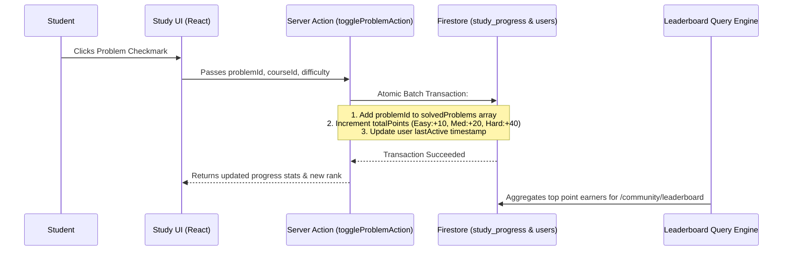

# Study Hub & Leaderboard Specification

---

## 1. Overview
The **MLSC Study Hub** (`mlscsvec.com/study`) is an interactive technical preparation environment that curates Data Structures, Algorithms, System Design, and Cloud computing tracks (including Striver's SDE Sheet).

---

## 2. Dynamic Progress & Sync Architecture

---

## 3. Key Features

1. **Category Filtering:** Filter problems by Arrays, Linked Lists, Dynamic Programming, Graphs, and Trees.
2. **Embedded Resources:** Direct links to LeetCode / GeeksForGeeks problems, video solutions, and article notes.
3. **Streak Tracking:** Computes daily active streaks to encourage consistent problem-solving habits.
