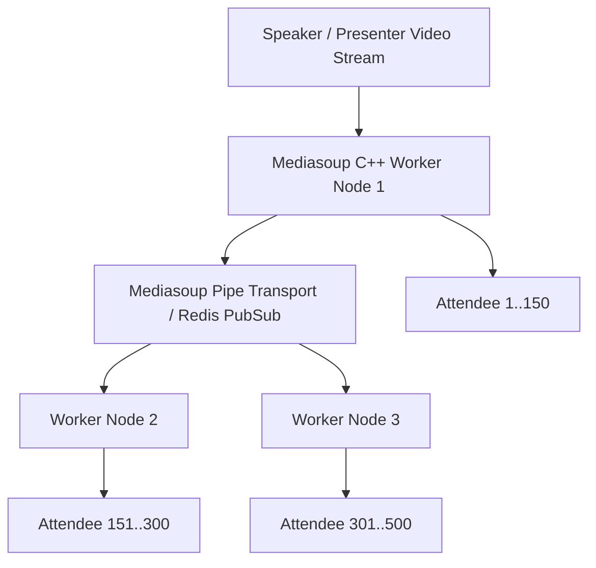

# WebRTC Meetings SFU Backend Specification

---

## 1. Overview
The **MLSC Meetings SFU** (`meet.mlscsvec.com`) provides custom, low-latency video, audio, and screen-sharing conferencing infrastructure designed to host 500+ concurrent student attendees during online technical bootcamps.

---

## 2. Distributed SFU Architecture

---

## 3. Technology Stack & Networking

- **Core Engine:** Mediasoup v3 (C++ media processing workers with Node.js orchestration).
- **Signaling Server:** Node.js + WebSockets / Socket.io with JWT authentication.
- **Inter-Worker Transport:** Redis pub/sub backplane and Mediasoup Pipe Transports for cross-worker stream distribution.
- **Firewall & Ports:**
  - Signaling: Port 443 (HTTPS/WSS)
  - RTP/RTCP Media: UDP Ports 40000 - 49999
  - STUN/TURN: CoTURN server on Port 3478 for NAT traversal across restrictive college firewalls.

---

## 4. Operational Playbook & Recovery

- If audio cuts out under high load: Mediasoup dynamically drops video simulcast layers to 360p/180p to prioritize crystal-clear audio packets.
- In case of a worker node crash: PM2 automatically restarts the node; the signaling server shifts new attendees to adjacent active workers.
