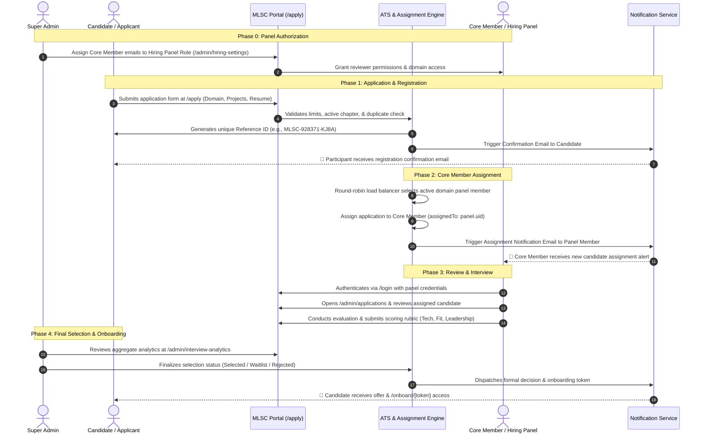

# Recruitment & Selection Process

MLSC SVEC operates a structured, merit-based, automated recruitment pipeline. Every recruitment cycle is managed through the central Applicant Tracking System (ATS) with role-based access control, automated email notifications, round-robin panel assignment, and multi-dimensional evaluation rubrics.

---

## 1. Complete End-to-End Hiring Workflow

---

## 2. Step-by-Step Hiring Lifecycle

### Step 0: Super Admin Pre-Requisite (Panel Role Provisioning)
Before applications can be assigned to Core Members, the **Super Admin** must explicitly configure the hiring panels:
1. Navigate to **Admin Console > Hiring Settings** (`/admin/hiring-settings`).
2. Add the institutional email addresses of authorized Core Members.
3. Assign each Core Member to their respective technical/non-technical domains:
   - *Generative AI & Machine Learning*
   - *Cloud Computing & DevOps*
   - *Full-Stack Web & Mobile Development*
   - *UI/UX Design & Creative Media*
   - *Event Operations & Public Relations*
4. Define the active recruitment chapter and set the registration limit (if applicable).
5. Open the hiring toggle (`isHiringOpen: true`).

> [!IMPORTANT]
> Candidates cannot be auto-assigned to a domain without at least one authorized and active Core Member in that domain's panel pool.

---

### Step 1: Candidate Application (`/apply`)
Prospective members and volunteers apply via the official recruitment form:
- **Personal & Academic Details:** Full name, roll number, department, semester, and institutional email.
- **Domain Preference:** Primary technical and non-technical domain interests.
- **Proof of Work:** GitHub profile, live project URLs, portfolio/Figma links, or writing samples.
- **Statement of Intent:** What drives their passion to join MLSC SVEC and what they hope to build.
- **Resume/CV:** PDF attachment parsed by internal summarization pipelines.

#### Immediate Automated Confirmation Email
Upon successful submission:
- The system generates a cryptographically random, collision-resistant Reference ID (e.g., `MLSC-784920-XE92`).
- A transactional email is immediately dispatched to the participant's email confirming that their application has been recorded in the system.
- The email provides the participant with their Reference ID and instructions on what to expect next.

---

### Step 2: Automated Assignment to Core Member Panel
1. The ATS queries all authorized panel members assigned to the candidate's applied domain.
2. An automated **round-robin load-balancing algorithm** identifies the reviewer with the lowest active application count.
3. The candidate's application is assigned to that Core Member (`assignedTo = reviewer.uid`).
4. An automated notification email is dispatched to the Core Member notifying them of the new candidate awaiting their review.

---

### Step 3: Hiring Panel Login & Application Review
Authorized Core Members log into the platform with their verified credentials:
1. Navigate to **Admin > Applications** (`/admin/applications`).
2. Filter applications by **Assigned to Me** or by domain.
3. Open the candidate review interface (`/admin/application/[id]`):
   - Review resume, project repositories, and live links.
   - Inspect AI-generated skill summaries and candidate highlights.
   - Schedule or conduct technical screening / culture-fit interviews.
4. Complete the standardized evaluation score card across 7 dimensions (scored 1 to 5):
   - **Technical Competency:** Fundamental domain knowledge, problem-solving ability, coding standards.
   - **Communication & Articulation:** Clarity of expression, active listening, structured explanation.
   - **Problem Solving & Adaptability:** Approach to debugging, algorithmic thinking, handling ambiguity.
   - **Team Fit & Collaboration:** Humility, willingness to learn, alignment with club ethos.
   - **Leadership & Ownership:** Initiative taken on past projects or organizational activities.
   - **Growth Mindset:** Receptiveness to feedback and enthusiasm for continuous learning.
   - **Confidence:** Poise and presence during discussions.
5. Provide detailed textual remarks and a preliminary recommendation:
   - `Shortlist for Interview`
   - `Recommend for Offer`
   - `Hold / Waitlist`
   - `Reject`

---

### Step 4: Final Selection & Council Ratification
1. The Lead Ambassador and Super Admins review aggregate scoring distributions on the **Interview Analytics Dashboard** (`/admin/interview-analytics`).
2. The council ratifies domain quotas and confirms candidate selections.
3. Status update emails are triggered in bulk or individually.
4. Selected candidates receive an encrypted onboarding link (`/onboard/[token]`) to complete their profile setup, accept the Code of Conduct, and join the internal Discord and GitHub organization.

---

## 3. Evaluation Rubric & Scoring Standards

| Score | Rating | Criteria Description |
| :---: | :--- | :--- |
| **5** | **Exceptional** | Demonstrates advanced independent mastery, high-impact projects, outstanding communication, and immediate leadership potential. |
| **4** | **Strong** | Solid technical foundations, verifiable project experience, enthusiastic team player, receptive to learning. |
| **3** | **Competent** | Meets baseline requirements; demonstrates raw curiosity and foundational skills that can be nurtured with mentorship. |
| **2** | **Developing** | Demonstrates interest but lacks foundational understanding or verifiable proof of work in the chosen domain. |
| **1** | **Unsatisfactory** | Inadequate preparation, disinterest, or conflict with club community standards. |

---

## 4. Ethical Standards & Anti-Bias Policy

> [!CAUTION]
> All recruitment decisions must adhere to strict ethical standards. Bias based on personal relationships, branch of study, gender, or academic year is strictly prohibited.

- **Objective Proof of Work:** Evaluations must be grounded in tangible project demonstrations or problem-solving tasks.
- **Dual-Reviewer Rule:** Any borderline candidate must be reviewed by at least two independent panel members before a final decision is made.
- **Audit Logs:** All score adjustments, status modifications, and reviewer remarks are permanently recorded in the immutable audit ledger.
